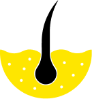

# AISkin Mobile App



## Introduction  
Welcome to **AISkin**, a mobile application designed to revolutionize skin health management using AI-powered technology. This repository contains the codebase for the AISkin mobile app, which enables users to detect skin diseases and receive personalized treatment recommendations by simply uploading an image of the affected area.

## About the Project  
The AISkin mobile app is developed following the MVVM (Model-View-ViewModel) architecture pattern. This ensures a clean separation of concerns, allowing for efficient data flow and modular components. The architecture includes:  

- **View Layer**: Activities and fragments that observe real-time data updates from the ViewModel.  
- **ViewModel Layer**: Manages UI-related data and handles communication between the View and Model.  
- **Model and Repository Layer**: Acts as the data source, bridging the API responses with the presentation layer for smooth data access and updates.

AISkin leverages state-of-the-art machine learning models integrated into the app, ensuring accurate skin disease detection and actionable guidance for users.

## Mobile Tech Stack  
The AISkin mobile app is built using the following technologies and tools:  

- **Android Studio**: The official IDE for Android app development.  
- **Kotlin**: A modern programming language for Android development.  
- **Jetpack Components**:  
  - **Lifecycle**: Manages the app's lifecycle.  
  - **Navigation**: Handles navigation and deep linking.  
  - **ViewModel**: Manages UI-related data efficiently.  
  - **LiveData**: Provides observable data holders.  
- **Retrofit2**: For seamless API communication and HTTP requests.  
- **Glide**: For efficient image loading and caching.  
- **DataStore**: Manages user preferences and app settings.  
- **ML Kit**: Google's machine learning SDK for image analysis and disease detection.  
- **Lottie**: Adds engaging animations for an enhanced user experience.  

## Installation Guide  
Follow these steps to set up and run the AISkin mobile app:  

1. **Clone the Repository**  
   ```bash  
   git clone https://github.com/AISkin/aiskin-mobile.git  
   ```  

2. **Open the Project**  
   Open the project in Android Studio.  

3. **Build and Run**  
   Build and deploy the app on an emulator or a physical device.  

4. **Dependencies**  
   Ensure all necessary dependencies are installed as defined in the `build.gradle` file.  

## UI/UX Design  
The app's user interface was designed using Figma. To view or contribute to the design, use the link below:
[Design Figma]([https://www.figma.com/file/KZkSefWCH4r1nmVsbxPiVu/AISkin?type=design&node-id=109%3A230&t=KGxvrQLeGzCrFJaW-1)


Let’s work together to enhance global skin health with **AISkin**! 💡
